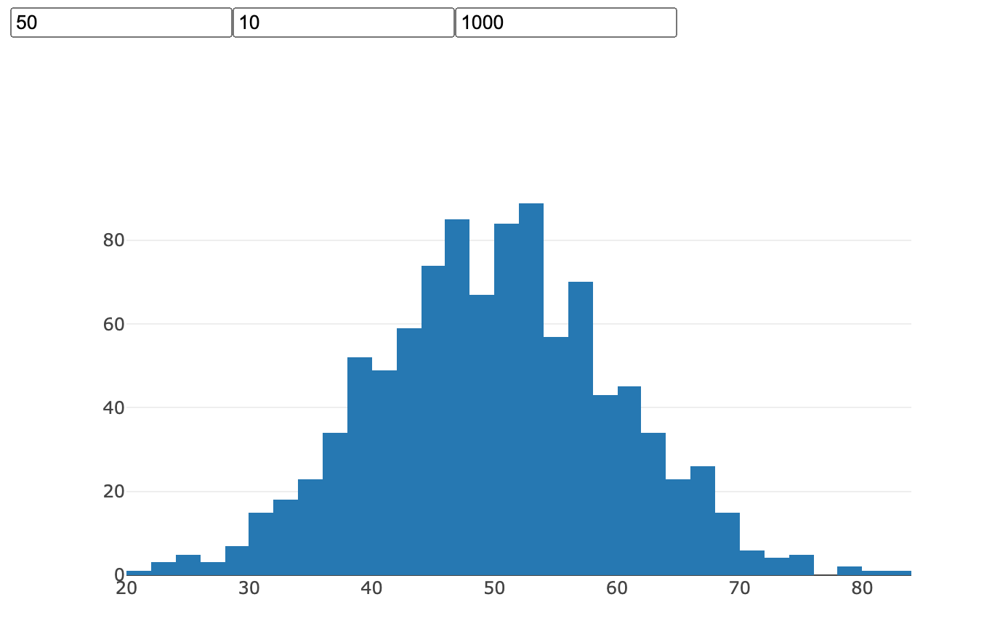

# Create a simple plotting application using Flask, React and Plotly

This is a tutorial for setting up a basic project that has a Flask backend, React frontend and displays a histogram using Plotly. The following setup was executed on macOS 10.15.4  

The instructions for basic Flask and React setup are taken from [this blog](https://blog.miguelgrinberg.com/post/how-to-create-a-react--flask-project)

## Requirements

Install the following

- [node.js](https://nodejs.org/en/) - The javascript runtime for the frontend
- [Yarn](https://yarnpkg.com/) - Package manager for node.js
- [Python 3+](https://www.python.org/)

## Starter React App

The easiest way to create a single page react app without dealing with a thousand dependencies is the [create-react-app](https://github.com/facebook/create-react-app) generator

```bash
$ npx create-react-app notes
$ cd notes/
```

The directory would look like below

```bash
$ ls -l
total 944
-rw-r--r--     1 aparnakorattyswaroopam  staff    2884 Sep 22 16:06 README.md
drwxr-xr-x  1023 aparnakorattyswaroopam  staff   32736 Sep 22 16:06 node_modules
-rw-r--r--     1 aparnakorattyswaroopam  staff     741 Sep 22 16:06 package.json
drwxr-xr-x     8 aparnakorattyswaroopam  staff     256 Sep 22 16:06 public
drwxr-xr-x    10 aparnakorattyswaroopam  staff     320 Sep 22 16:06 src
-rw-r--r--     1 aparnakorattyswaroopam  staff  472450 Sep 22 16:06 yarn.lock
```

## Install plotly.js

```bash
$ npm install react-plotly.js plotly.js
```

## Create a Flask API Backend

Create a folder for the flask backend within the main project and setup a virtual environment within it

```bash
$ mkdir api
$ cd api/
$ python3 -m venv venv
$ source venv/bin/activate
```

### Install `Flask` and `python-dotenv`

```bash
(venv) $ pip install flask python-dotenv
```

### Setup Flask environment

Flask imports the application from the place indicated by the FLASK_APP environment variable. 
To avoid having to manually set this variable every time, create a .flaskenv file, which Flask automatically imports into the environment on startup if it finds the python-dotenv package installed. 

the .flaskenv file

```haml
FLASK_APP=api.py
FLASK_ENV=development
```

The `FLASK_ENV` variable, with a setting of `development`, enables Flask's debug mode.

### Starter API code

Add the following starter code to `api.py`

```python
import time
from flask import Flask

app = Flask(__name__)

@app.route('/check')
def get_current_time():
    return {'handshake': 'hello'}
```

This is the current state of the `api` folder

```bash
$ ls -al
total 40
drwxr-xr-x   7 aparnakorattyswaroopam  staff   224 Sep 22 17:10 .
drwxr-xr-x  13 aparnakorattyswaroopam  staff   416 Sep 22 17:11 ..
-rw-r--r--   1 aparnakorattyswaroopam  staff    38 Sep 22 17:05 .flaskenv
-rw-r--r--   1 aparnakorattyswaroopam  staff   138 Sep 22 17:11 api.py
drwxr-xr-x   7 aparnakorattyswaroopam  staff   224 Sep 22 17:10 venv
```

Let's take it for a spin, execute `flask run` inside the `api` folder

```bash
$ flask run
 * Serving Flask app "api.py" (lazy loading)
 * Environment: development
 * Debug mode: on
 * Running on http://127.0.0.1:5000/ (Press CTRL+C to quit)
 * Restarting with stat
 * Debugger is active!
 * Debugger PIN: 694-800-414
```

got to `http://127.0.0.1:5000/check` on a browser, and you should see the following response

```json
{
  "handshake": "hello"
}
```

## React Configuration Changes

The React project created by the create-react-app utility left a package.json file with the project's configuration. There are a couple of changes to make in this file to improve the integration between the React and the Flask sides.

The first change is to set up "proxy" redirection from React to Flask. You will see in a moment that the React project will run a web server on port 3000, while Flask runs its own server on port 5000. In most deployments, however, the frontend files and the API endpoints are all served from the same domain and port, which makes everything work seamlessly by avoiding cross-origin issues. The React project can be configured to redirect any requests it receives on its port 3000 that it does not understand into another server. This is configured simply by adding a proxy key at the bottom package.json:

```json
{

  ... leave all other configuration options alone ...

  "proxy": "http://localhost:5000"
}
```

The React application uses `yarn` as a command manager. For example, the frontend server is started with the `yarn start` command. There is also a `yarn test` and a few more commands.

The commands to manage the Flask app can be integrated with yarn as well. Somewhere in the middle of `package.json` you will find a scripts key. You can add any custom commands inside it:

```json
  "scripts": {
    "start": "react-scripts start",
    "start-api": "cd api && venv/bin/flask run --no-debugger",
    "build": "react-scripts build",
    "test": "react-scripts test",
    "eject": "react-scripts eject"
  },   
```

The new entry called `start-api`, is to run the Flask server. 

The value of this key is the command that needs to be executed, which in this case involves changing into the api subdirectory and then running the `flask run` command. The command activates the virtual env before running Flask

The `--no-debugger` option is important. Since this Flask backend is strictly an API server, we will never be serving complete pages, so having the browser-based debugger enabled serves no purpose, as it's just going to mess up the JSON responses that the API returns. You will see stack traces of your errors in the terminal.

## Running the combined project

Use two windows, one for the frontend server and one for the flask server

**Start the frontend server**

```bash
$ yarn start
```

**Start Flask backend server**

```bash
$ yarn start-api
```

## A simple Flask API that returns data

API to return data points randomly picked from a normal distribution based on the `mean`, `standard deviation` and `number` of data points passed as params

```python
import numpy as np
from flask import request

@app.route('/getHistData', methods=['POST'])
def get_hist_data():
  mean = float(request.json['mean'])
  std = float(request.json['std'])
  num_points = int(request.json['num_points'])
  x = np.random.normal(loc=mean, scale=std, size=num_points)
  resp = {
            'data': x.tolist()
         }
  
  return resp
```

## A single page react application

**Delete all files that were auto-generated in the `/src` folder**

Create a file called `index.js`. [This is the entry point that's expected by the `create-react-app` ](https://stackoverflow.com/a/42440000)

Paste the following code into `index.js`

A simple react frontend that has three input boxes for mean, standard deviation and number of data points

The app plots a histogram of the random values returned by the flask server



```javascript
import React from 'react';
import ReactDOM from 'react-dom';
import Plot from 'react-plotly.js';

class HistPlot extends React.Component {

  render(){
    return(
      <Plot 
        data={[
          {
            x: this.props.histData,
            type: 'histogram'
          }
        ]}
      />
    )
  }
}

class BaseDiv extends React.Component{
  constructor(props){
    super(props);
    this.state = {
      histData: null,
      mean: 50,
      std: 10,
      num_points: 1000
    };
  }

  // 

  updateHistData(){
    const requestOptions = {method: 'POST',
                            headers: { 'Content-Type': 'application/json' },
                            body: JSON.stringify({ "mean": this.state.mean,
                                                  "std": this.state.std,
                                                  "num_points":this.state.num_points})};


    
    fetch('/getHistData', requestOptions)
    .then(res => res.json())
    .then(
      (result) => {
        this.setState({
          histData: result.data
        });
      })
  }

  componentDidMount(){
    this.updateHistData()
  }

  handleInputChange(event){
    const val = event.target.value;
    const name = event.target.name;

    if(val && name){
      this.setState({ [name] : parseInt(val)})
    }

    this.updateHistData()
  }


  render(){
    return(
      <div>
        <div>
          <input type='text' value={this.state.mean} name='mean' onChange={this.handleInputChange.bind(this)}/>
          <input type='text' value={this.state.std} name='std' onChange={this.handleInputChange.bind(this)}/>
          <input type='text' value={this.state.num_points} name='num_points' onChange={this.handleInputChange.bind(this)}/>
        </div>
        <HistPlot histData={this.state.histData}/>
      </div>
    )
  }
}

ReactDOM.render(
  <BaseDiv/>,
  document.getElementById('root')
)
```

## Accompanying Code

The accompanying code does not retain the original project structure created by `create-react-app`. 
